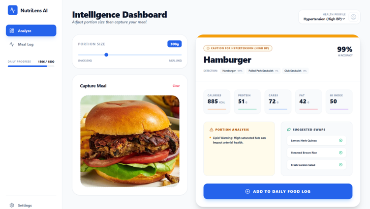
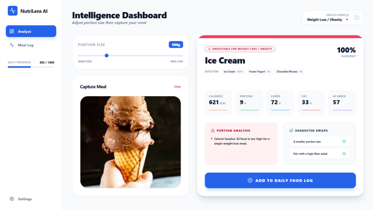
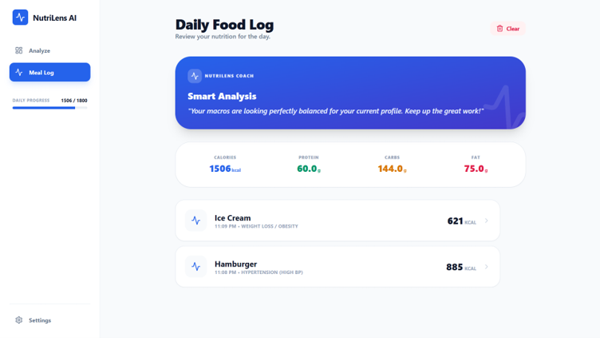

# 🥗 NutriLens
### AI-Powered Food Recognition & Personalised Nutrition Analysis

NutriLens is a full-stack food intelligence application that combines **deep-learning image classification**, **nutrition data**, and a **health-profile-based nutrition engine** to provide personalised food analysis.

> Upload a food image → identify the food → view nutrition information → adjust portion size → receive a nutrition-based suitability assessment.


---

## 🚀 Quick Links

- 🌐 **Live Demo:** https://nutrilens-tan-three.vercel.app/
- 🤖 **Trained ML Model:** https://huggingface.co/SuperEliteAgent/nutrilens-model

---

## 📌 Overview

NutriLens is an end-to-end food intelligence system that combines deep learning image classification with a nutrition analysis engine.

Upload a food image and NutriLens can:

- **Identify** the food using a fine-tuned EfficientNetB0 model trained on 101 Food-101 classes
- **Retrieve** nutritional information including calories, protein, carbohydrates, fat, sugar, sodium and saturated fat
- **Calculate** Glycemic Load based on the selected portion
- **Assess** nutritional suitability for a selected health profile
- **Scale** nutrition values according to portion size
- **Track** daily calories and macros against personalised targets
- **Suggest** healthier alternatives based on the selected profile

> **Important:** NutriLens provides a nutrition-based assessment using predefined nutritional thresholds. It is not a medical diagnostic system and should not replace professional medical advice.

---

## 🖼️ Application Screenshots

### Food Analysis — Suitable / Caution



### Food Analysis — Unsuitable



### Daily Food Log



---

## ✨ Features

- **AI food recognition** using EfficientNetB0 + transfer learning
- **Top-3 predictions** with confidence scores
- **Nutrition analysis** for calories, protein, carbohydrates, fat, sugar, sodium and saturated fat
- **Live portion scaling** from 50g–1000g
- **Glycemic Load calculation**
- **Indian food coverage** with an extended nutrition database containing 30+ Indian dishes
- **USDA FoodData Central fallback** for foods outside the local database
- **Daily macro tracker** for calories, protein, carbohydrates and fat
- **Health-profile-based suitability assessment**
- **Healthier food alternatives**
- REST API using FastAPI
- Interactive React frontend using Vite and Tailwind CSS

---

## 🧠 Model Performance

| Metric | Value |
|---|---|
| Architecture | EfficientNetB0 + Transfer Learning |
| Dataset | Food-101 |
| Training Strategy | Two-phase fine-tuning |
| Validation Accuracy | **83.46%** |
| Test Accuracy | **82.57%** |
| Model Size | ~38 MB (`.h5`) |
| Inference Time | ~45 ms (CPU) |

### Training Summary

- Base model: EfficientNetB0 with ImageNet weights
- Phase 1: 10 epochs, frozen base, learning rate `1e-3`
- Phase 2: 20 epochs, full fine-tuning, learning rate `1e-4`
- Augmentation:
  - RandomFlip
  - RandomRotation
  - RandomZoom
  - RandomContrast

---

## 🏗️ System Architecture

```text
                    ┌─────────────────────┐
                    │    React Frontend   │
                    │   Vite + Tailwind   │
                    └──────────┬──────────┘
                               │
                         HTTP / REST
                               │
                               ▼
                    ┌─────────────────────┐
                    │     FastAPI API     │
                    │   Request Handling  │
                    └──────────┬──────────┘
                               │
              ┌────────────────┼────────────────┐
              ▼                ▼                ▼
      ┌──────────────┐ ┌───────────────┐ ┌───────────────┐
      │ EfficientNet │ │ Nutrition DB  │ │ USDA FoodData │
      │ Food-101     │ │ + Health      │ │ Central API   │
      │ Classifier   │ │ Rules         │ │ Fallback      │
      └──────┬───────┘ └───────┬───────┘ └───────────────┘
             │                 │
             └────────┬────────┘
                      ▼
              ┌───────────────┐
              │ Nutrition +   │
              │ Suitability   │
              │ Assessment    │
              └───────────────┘
```

---

## 🗂️ Project Structure

```text
NutriLens/
├── backend/
│   ├── api.py                       # FastAPI server and endpoints
│   ├── predict.py                   # EfficientNetB0 inference module
│   ├── nutrition_data.py            # Nutrition DB, health profiles and suitability logic
│   ├── usda_api.py                  # USDA FoodData Central API client + cache
│   ├── schemas.py                   # Pydantic request/response models
│   ├── class_names.json             # Food-101 class label mapping
│   ├── efficientnet_b0_101_best.h5  # Trained EfficientNetB0 model 
│   └── requirements.txt             # Python dependencies
│
├── frontend/
│   ├── src/
│   │   ├── App.jsx                  # Main application
│   │   └── components/
│   │       ├── NutritionCard.jsx
│   │       ├── Suitability.jsx
│   │       └── ImageUploader.jsx
│   ├── package.json
│   └── vite.config.js
│
├── docs/
│   ├── suitable.png
│   ├── unsuitable.png
│   └── food_log.png
│
├── per_class_accuracy.png
├── README.md
└── .gitignore
```

> **Note:** `backend/.env` is not shown above, it is created locally (see [Environment Variables](#-environment-variables)) and is excluded from the repository via `.gitignore`.

---

## ⚙️ Setup & Installation

### Prerequisites

- Python **3.10 or 3.11** recommended
- Node.js **18+**
- npm
- Git

### 1. Clone the Repository

```bash
git clone https://github.com/coderelite-gif/Nutrilens.git
cd Nutrilens
```

---

### 2. Trained ML Model

The trained EfficientNetB0 model is **included directly in the repository**:

```text
backend/efficientnet_b0_101_best.h5
```

The model is approximately **38 MB** and is loaded automatically by the backend for food-image inference. No separate download is required when cloning this repository.

A copy of the same trained model is also uploaded on Hugging Face:

https://huggingface.co/SuperEliteAgent/nutrilens-model

---

### 3. Backend Setup

#### Windows

```powershell
cd backend

python -m venv venv
venv\Scripts\activate

pip install -r requirements.txt

uvicorn api:app --reload --host 0.0.0.0 --port 8000
```

#### macOS / Linux

```bash
cd backend

python3 -m venv venv
source venv/bin/activate

pip install -r requirements.txt

uvicorn api:app --reload --host 0.0.0.0 --port 8000
```

Backend:

```text
http://localhost:8000
```

Interactive API documentation:

```text
http://localhost:8000/docs
```

---

### 4. Frontend Setup

Open a second terminal:

```bash
cd frontend
npm install
npm run dev
```

Frontend:

```text
http://localhost:5173
```

---

## 🔐 Environment Variables

The USDA FoodData Central fallback uses an API key. Get a free key from:

https://fdc.nal.usda.gov/api-key-signup.html

Then create a file named `.env` inside the `backend/` folder with the following content:

```env
USDA_API_KEY=your_api_key_here
```

The key is optional for the core flow: foods in the local nutrition database, including the Indian dishes, work without it. The key is only needed for foods outside the local database, and the app falls back gracefully if it is not set.

---

## 🔌 API Endpoints

| Endpoint | Method | Description |
|---|---|---|
| `/api/analyze-image` | POST | Upload an image and receive food prediction, nutrition, suitability assessment, warnings and alternatives |
| `/api/recalculate-status` | POST | Recalculate suitability using nutrition data and a selected health profile |
| `/api/health` | GET | Backend health check |

### Example: Analyse an Image

```bash
curl -X POST "http://localhost:8000/api/analyze-image" -F "file=@pizza.jpg" -F "grams=200" -F "health_profile=Type 2 Diabetes"
```

---

## 🏥 Supported Health Profiles

| Profile | Key Metrics Monitored |
|---|---|
| Type 2 Diabetes | Glycemic Load, Sugar, Carbohydrates |
| Hypertension | Sodium, Saturated Fat |
| Weight Loss / Obesity | Calories, Sugar |
| Gym / Muscle Gain | Protein Density, Calories |
| Healthy Adult | Calories, Sodium |

The application returns a nutrition-based **SUITABLE / CAUTION / UNSUITABLE** assessment with relevant warnings and alternative food suggestions according to the selected profile.

---

## 🛠️ Technical Decisions

- **EfficientNetB0 + transfer learning:** a strong accuracy-to-size tradeoff for CPU inference (~45 ms, ~38 MB); starting from ImageNet weights avoids training from scratch on Food-101.

- **Two-phase fine-tuning:** training the new head first with a frozen base, then unfreezing at a lower learning rate, avoids destroying pretrained features early.

- **FastAPI:** native Pydantic validation and automatic OpenAPI docs, and it sits in the same Python ecosystem as the TensorFlow model.

- **Local DB first, USDA second:** the local table gives fast, curated results (including Indian dishes that Food-101 barely covers); USDA only handles the long tail.

- **Rule-based suitability engine:** thresholds are transparent and explainable, which suits a health-adjacent tool better than an opaque model.

---

## ⚠️ Limitations

- The classifier only knows the **101 Food-101 classes**; other foods will be mapped to the closest class.
- Indian dishes are covered in the **nutrition database**, but the classifier is not trained on a dedicated Indian dataset.
- Portion size is **user-selected**, not estimated from the image.
- Nutrition values are per-100g reference data scaled by portion, so they are estimates for mixed dishes.
- Suitability results are rule-based and **not medical advice**.

---

## 🍱 Nutrition & Data Sources

NutriLens combines:

1. **Local nutrition data** for commonly used foods and 30+ Indian dishes.
2. **USDA FoodData Central API** as a fallback for foods outside the local database.
3. Calculated values for **portion-adjusted nutrition** and **Glycemic Load**.

---

## 📊 Food-101 Classes

The model recognises 101 Food-101 categories including:

`apple pie`, `baklava`, `bibimbap`, `caesar salad`, `cheesecake`, `chicken curry`, `chocolate cake`, `churros`, `dumplings`, `eggs benedict`, `falafel`, `french fries`, `fried rice`, `guacamole`, `hamburger`, `hot dog`, `ice cream`, `lasagna`, `macarons`, `omelette`, `pad thai`, `pancakes`, `pizza`, `ramen`, `samosa`, `sashimi`, `spaghetti carbonara`, `sushi`, `tacos`, `tiramisu`, `waffles`, and other Food-101 categories.

---

## 📈 Project Evaluation

The project currently reports:

- **Validation accuracy:** 83.46%
- **Test accuracy:** 82.57%
- **CPU inference time:** approximately 45 ms

## 🔮 Possible Future Improvements

- Add an explicit **out-of-distribution / unknown-food detector** for foods outside Food-101.
- Expand the Indian food dataset and nutrition database.
- Improve model accuracy with additional food images and fine-tuning.
- Add automated backend and frontend tests.
- Add persistent user accounts and database-backed meal history.
- Deploy inference with scalable workers for higher traffic.
- Add model confidence thresholds and clearer uncertainty messaging.

---

## 🙏 Acknowledgements

- **Food-101 Dataset** — Bossard et al., ECCV 2014
- **EfficientNet** — Tan & Le, ICML 2019
- **USDA FoodData Central** — U.S. Department of Agriculture
- **International GI Database** — University of Sydney

---

## 📄 Disclaimer

NutriLens is an educational/software project that provides nutrition-based estimates and rule-based suitability assessments. It is not a medical diagnostic system and should not be used as a substitute for professional medical advice.

---

<p align="center">Built with ❤️ using Python, TensorFlow, FastAPI and React</p>
